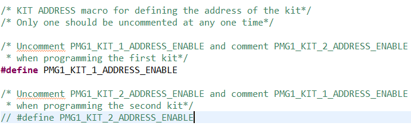
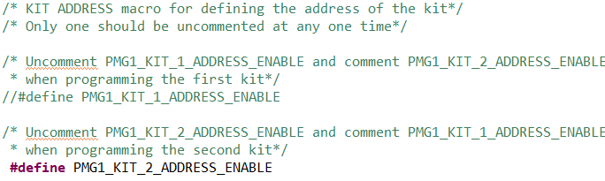

# EZ-PD&trade; PMG1 MCU: I2C multi-master

This PMG1 code example demonstrates how to configure an SCB in I2C master-slave configuration to send and receive I2C data and toggle the state of the onboard LEDs. The PMG1 SCB when configured in master-slave mode can act as both master and slave. By default the I2C interface acts as a slave .When the user button on the kit is pressed , the I2C interface switches to master mode and sends the LED state  to the partner device . I2C interfce becomes slave again after the data is transmitted. A second PMG1 Kit is recommended for testing this code example.

[View this README on GitHub.](https://github.com/Infineon/mtb-example-pmg1-i2c-multi-master)

[Provide feedback on this code example.](https://cypress.co1.qualtrics.com/jfe/form/SV_1NTns53sK2yiljn?Q_EED=eyJVbmlxdWUgRG9jIElkIjoiQ0UyMzQ3NzciLCJTcGVjIE51bWJlciI6IjAwMi0zNDc3NyIsIkRvYyBUaXRsZSI6IkVaLVBEJnRyYWRlOyBQTUcxIE1DVTogSTJDIG11bHRpLW1hc3RlciIsInJpZCI6ImF1c3RpbmEiLCJEb2MgdmVyc2lvbiI6IjIuMC4wIiwiRG9jIExhbmd1YWdlIjoiRW5nbGlzaCIsIkRvYyBEaXZpc2lvbiI6Ik1DRCIsIkRvYyBCVSI6IldJUkVEIiwiRG9jIEZhbWlseSI6IlRZUEUtQyJ9)

## Requirements

- [ModusToolbox&trade; software](https://www.infineon.com/modustoolbox) v3.0 or later (tested with v3.0)
- Board support package (BSP) minimum required version: 3.0.0
- Programming language: C
- Associated parts: All [EZ-PD&trade; PMG1 MCU](https://www.infineon.com/PMG1) parts

## Supported toolchains (make variable 'TOOLCHAIN')

- GNU Arm® Embedded Compiler v10.3.1 (`GCC_ARM`) - Default value of `TOOLCHAIN`
- Arm&reg; Compiler v6.13 (`ARM`)
- IAR C/C++ Compiler v8.42.2 (`IAR`)

## Supported kits (make variable 'TARGET')

- [EZ-PD&trade; PMG1-S0 prototyping kit](https://www.infineon.com/CY7110) (`PMG1-CY7110`)
- [EZ-PD&trade; PMG1-S1 prototyping kit](https://www.infineon.com/CY7111) (`PMG1-CY7111`) - Default value of `TARGET`
- [EZ-PD&trade; PMG1-S2 prototyping kit](https://www.infineon.com/CY7112) (`PMG1-CY7112`)
- [EZ-PD&trade; PMG1-S3 prototyping kit](https://www.infineon.com/CY7113) (`PMG1-CY7113`)

## Hardware setup

A kit listed in [Supported kits](#supported-kits-make-variable-target) runs this code example and a second PMG1 kit, loaded with this same code example (but with a different slave address, as mentioned in the [Operations](#operation) section) is recommended for testing this code example.

1. Use jumper wires to establish an I2C connection between the two PMG1 kits using the pin assignments for the different supported kits as follows:

      **Table 1. Pin connections for I2C**

      | PMG1 prototyping kit | SDA | SCL | Ground |
      | :-------------- | :--- | :--- | :----- |
      | PMG1-CY7110    | J7.7 | J7.6| J7.3 |
      | PMG1-CY7111    | J7.7 | J7.6| J7.3  |
      | PMG1-CY7112    | J7.7 | J7.6| J7.3  |
      | PMG1-CY7113    | J7.6 | J7.7 | J7.3  |

      Connect the SDA line of kit 1 to the SDA line of kit 2. Similarly, connect the SCL and ground lines.


2. If UART DEBUG PRINT messages are enabled, UART connection are needed. Pin connections for UART is as shown in the below table. For the following revisions of the PMG1 prototyping kits, connect the UART Tx and UART Rx lines from the PMG1 kit to J3.8 and J3.10 on KitProg3 respectively to establish a UART connection between KitProg3 and the PMG1 device.

      **Table 2. Pin connections for UART**

      | PMG1 kit | UART Tx | UART Rx |
      | :-------       | :------------ | :----------     |
      | PMG1-CY7110    | ---  | ---   |
      | PMG1-CY7111 (revision 2 or lower) | J6.10 to J3.8 | J6.9 to J3.10 |
      | PMG1-CY7112 (revision 2 or lower) | J6.10 to J3.8 | J6.9 to J3.10 |
      | PMG1-CY7113 (revision 3 or lower) | J6.10 to J3.8 | J6.9 to J3.10 |


      **Notes:**

      - All prototyping kits with a higher revision have UART lines internally connected. Therefore, external wiring is not required.

      - UART is disabled for PMG1-S0 kit in this code example because both the kit UART (P1.2 and P1.3 with hardware connection to KitProg) and the kit I2C (P2.2 and P2.3 with onboard pull-ups) use the same SCB 1 block on the PMG1-S0 kit.

See the kit user guide for more details on configuring the board.

## Software setup

Install a terminal emulator if you don't have one. Instructions in this document use [Tera Term](https://ttssh2.osdn.jp/index.html.en).

## Using the code example

Create the project and open it using one of the following:

<details><summary><b>In Eclipse IDE for ModusToolbox&trade; software</b></summary>

1. Click the **New Application** link in the **Quick Panel** (or, use **File** > **New** > **ModusToolbox&trade; Application**). This launches the [Project Creator](https://www.infineon.com/ModusToolboxProjectCreator) tool.

2. Pick a kit supported by the code example from the list shown in the **Project Creator - Choose Board Support Package (BSP)** dialog.

   When you select a supported kit, the example is reconfigured automatically to work with the kit. To work with a different supported kit later, use the [Library Manager](https://www.infineon.com/ModusToolboxLibraryManager) to choose the BSP for the supported kit. You can use the Library Manager to select or update the BSP and firmware libraries used in this application. To access the Library Manager, click the link from the **Quick Panel**.

   You can also just start the application creation process again and select a different kit.

   If you want to use the application for a kit not listed here, you may need to update the source files. If the kit does not have the required resources, the application may not work.

3. In the **Project Creator - Select Application** dialog, choose the example by enabling the checkbox.

4. (Optional) Change the suggested **New Application Name**.

5. The **Application(s) Root Path** defaults to the Eclipse workspace which is usually the desired location for the application. If you want to store the application in a different location, you can change the *Application(s) Root Path* value. Applications that share libraries should be in the same root path.

6. Click **Create** to complete the application creation process.

For more details, see the [Eclipse IDE for ModusToolbox&trade; software user guide](https://www.infineon.com/MTBEclipseIDEUserGuide) (locally available at *{ModusToolbox&trade; software install directory}/docs_{version}/mt_ide_user_guide.pdf*).

</details>

<details><summary><b>In command-line interface (CLI)</b></summary>

ModusToolbox&trade; software provides the Project Creator as both a GUI tool and the command line tool, "project-creator-cli". The CLI tool can be used to create applications from a CLI terminal or from within batch files or shell scripts. This tool is available in the *{ModusToolbox&trade; software install directory}/tools_{version}/project-creator/* directory.

Use a CLI terminal to invoke the "project-creator-cli" tool. On Windows, use the command line "modus-shell" program provided in the ModusToolbox&trade; software installation instead of a standard Windows command-line application. This shell provides access to all ModusToolbox&trade; software tools. You can access it by typing `modus-shell` in the search box in the Windows menu. In Linux and macOS, you can use any terminal application.

The "project-creator-cli" tool has the following arguments:

Argument | Description | Required/optional
---------|-------------|-----------
`--board-id` | Defined in the `<id>` field of the [BSP](https://github.com/Infineon?q=bsp-manifest&type=&language=&sort=) manifest | Required
`--app-id`   | Defined in the `<id>` field of the [CE](https://github.com/Infineon?q=ce-manifest&type=&language=&sort=) manifest | Required
`--target-dir`| Specify the directory in which the application is to be created if you prefer not to use the default current working directory | Optional
`--user-app-name`| Specify the name of the application if you prefer to have a name other than the example's default name | Optional

<br>

The following example will clone the "[I2C multi-master](https://github.com/Infineon/mtb-example-pmg1-i2c-multi-master)" application with the desired name "MyI2C multi-master" configured for the *PMG1-CY7111* BSP into the specified working directory, *C:/mtb_projects*:

   ```
   project-creator-cli --board-id PMG1-CY7111 --app-id mtb-example-pmg1-i2c-multi-master --user-app-name MyI2Cmulti-master --target-dir "C:/mtb_projects"
   ```

**Note:** The project-creator-cli tool uses the `git clone` and `make getlibs` commands to fetch the repository and import the required libraries. For details, see the "Project creator tools" section of the [ModusToolbox&trade; software user guide](https://www.infineon.com/ModusToolboxUserGuide) (locally available at *{ModusToolbox&trade; software install directory}/docs_{version}/mtb_user_guide.pdf*).

To work with a different supported kit later, use the [Library Manager](https://www.infineon.com/ModusToolboxLibraryManager) to choose the BSP for the supported kit. You can invoke the Library Manager GUI tool from the terminal using `make library-manager` command or use the Library Manager CLI tool "library-manager-cli" to change the BSP.

The "library-manager-cli" tool has the following arguments:

Argument | Description | Required/optional
---------|-------------|-----------
`--add-bsp-name` | Name of the BSP that should be added to the application | Required
`--set-active-bsp` | Name of the BSP that should be as active BSP for the application | Required
`--add-bsp-version`| Specify the version of the BSP that should be added to the application if you do not wish to use the latest from manifest | Optional
`--add-bsp-location`| Specify the location of the BSP (local/shared) if you prefer to add the BSP in a shared path | Optional

<br>

Following example adds the PMG1-CY7111 BSP to the already created application and makes it the active BSP for the app:

   ```
   ~/ModusToolbox/tools_3.0/library-manager/library-manager-cli --project "C:/mtb_projects/MyI2Cmulti-master" --add-bsp-name PMG1-CY7111--add-bsp-version "latest-v3.X" --add-bsp-location "local"

   ~/ModusToolbox/tools_3.0/library-manager/library-manager-cli --project "C:/mtb_projects/MyI2Cmulti-master" --set-active-bsp APP_PMG1-CY7111
   ```

</details>

<details><summary><b>In third-party IDEs</b></summary>

Use one of the following options:

- **Use the standalone [Project Creator](https://www.infineon.com/ModusToolboxProjectCreator) tool:**

   1. Launch Project Creator from the Windows Start menu or from *{ModusToolbox&trade; software install directory}/tools_{version}/project-creator/project-creator.exe*.

   2. In the initial **Choose Board Support Package** screen, select the BSP, and click **Next**.

   3. In the **Select Application** screen, select the appropriate IDE from the **Target IDE** drop-down menu.

   4. Click **Create** and follow the instructions printed in the bottom pane to import or open the exported project in the respective IDE.

<br>

- **Use command-line interface (CLI):**

   1. Follow the instructions from the **In command-line interface (CLI)** section to create the application.

   2. Export the application to a supported IDE using the `make <ide>` command.

   3. Follow the instructions displayed in the terminal to create or import the application as an IDE project.

For a list of supported IDEs and more details, see the "Exporting to IDEs" section of the [ModusToolbox&trade; software user guide](https://www.infineon.com/ModusToolboxUserGuide) (locally available at *{ModusToolbox&trade; software install directory}/docs_{version}/mtb_user_guide.pdf*).

</details>


## Operation

1. Choose any two of the PMG1 prototyping kits from the [list of supported kits](#supported-kits-make-variable-target) and ensure that the steps listed in the [Hardware setup](#hardware-setup) section are completed.

2. Ensure that the jumper shunt on power selection jumper (J5) is placed at position 2-3 to enable programming.

3. Connect the first PMG1 kit to your PC using the USB cable through the KitProg3 USB Type-C port (J1). This cable is used for programming the PMG1 device and as a USB-UART bridge to the PC during operation.

4. Verify that the `PMG1_KIT_1_ADDRESS_ENABLE` macro in the *I2CMasterSlave.h* file is uncommented and make sure the `PMG1_KIT_2_ADDRESS_ENABLE` macro is commented out.

   **Figure 1. Kit address macro setting for kit 1**

   
   <br>

5. Program the PMG1 kit using one of the following:

   <details><summary><b>Using Eclipse IDE for ModusToolbox&trade; software</b></summary>

      1. Select the application project in the Project Explorer.

      2. In the **Quick Panel**, scroll down, and click **\<Application Name> Program (KitProg3_MiniProg4)**.
   </details>

   <details><summary><b>Using CLI</b></summary>

     From the terminal, execute the `make program` command to build and program the application using the default toolchain to the default target. The default toolchain and target are specified in the application's Makefile but you can override those values manually:
      ```
      make program TOOLCHAIN=<toolchain>
      ```

      Example:
      ```
      make program TOOLCHAIN=GCC_ARM
      ```
   </details>

6. After programming the first kit, disconnect the USB cable and change the position on the power selection jumper (J5) to 1-2 to power the kit through the PMG1 USB PD sink port (J10).

7. Now, for the second PMG1 kit, uncomment the `PMG1_KIT_2_ADDRESS_ENABLE` macro in the *I2CMasterSlave.h* file and ensure that the `PMG1_KIT_1_ADDRESS_ENABLE` macro is commented out.

   **Figure 2. Kit address macro setting for kit 2**

   
   <br>

8. Connect and program the second kit by using Step 5.

9. After programming the kits, disconnect the USB cable and change the position on the power selection jumper (J5) to 1-2 to power the kits through the PMG1 USB PD sink port (J10).

10. Confirm that the LED on the second kit toggles each time the user button on the first kit is pressed and vice versa.


## Debugging

You can debug the example to step through the code. In the IDE, use the **\<Application Name> Debug (KitProg3_MiniProg4)** configuration in the **Quick Panel**. Ensure that the board is connected to your PC using the USB cable through the KitProg3 USB connector and the jumper shunt on power selection jumper (J5) is placed at position 1-2.

See the "Debug mode" section in the kit user guide for debugging the application on CY7110 prototyping kit. For more details, see the "Program and debug" section in the [Eclipse IDE for ModusToolbox&trade; software user guide](https://www.infineon.com/MTBEclipseIDEUserGuide).

## Design and implementation

In this code example, the PMG1 SCB block is configured as I2C in master-slave mode.

When the switch on one kit is pressed, the kit acts as the master and sends an I2C read command to the second kit. The second kit acts as the slave, and so sends the current state of the user LED on the slave. The master then sends the command to invert the state of the LED on the slave based on the current status of the LED read from the slave previously.

Both kits initially configure the I2C read buffer with the  `Header`, the `Kit BSP Number`, the `Status` of the LED, and a `Footer`. When a master triggers an I2C read operation, this I2C read buffer is used by the slave to respond back to the master.

The kit BSP number is used only to identify the PMG1 kit BSP of the master or slave that was addressed, when printing it to the UART terminal. THis is not used for any checks.

Figure 5 shows the firmware flowchart for the design.

**Figure 5. Firmware flowchart**


<br>


SCB0 is used for I2C communication (except PMG1-S0 where SCB1 is used for I2C) and is configured for master-slave operation with the 'Store Config in Flash' option deselected. This allows the modification of the I2C configurations during run time. This is done for changing the slave address assigned for the kit from firmware (See line 117 in *I2CMasterSlave.c*).

**Figure 6. I2C configuration**


<br>


### Packet format read by the master from the slave (status packet)

The master sends the I2C read command to read the current state of the LED on the second kit that acts as the slave. The read command will retrieve three bytes of data from the slave, which consist of a `Header`, the `Kit BSP Number` of the slave, the `Status` of the LED, and a `Footer`. The master decides the command to send to the slave to invert the state of the LED based on the `Status` read from the slave.

| Header  | BSP | Status | Footer  |
|------|------------|--------|------|
| 0xDC | KIT BSP Number | 0x76(LED OFF) or 0xE3(LED ON) | 0x89 |


### Packet format sent by the master to the slave (command packet)

The master writes the command packet (to the slave) to set the state of the slave LED based on the LED status packet read previously from the slave. To do this, the master populates the I2C write buffer with a `Header` followed by the `Kit BSP Number` of the master, `Command` to set or reset the LED state of the slave, and a `Footer`. This command packet is decoded by the slave which will then set the LED state according to the received command only if the header and footer are received correctly.

| Header  | BSP | Command | Footer  |
|------|------------|--------|------|
| 0xDC | KIT BSP Number | 0x76(LED OFF) or 0xE3(LED ON) | 0x89 |

SCB 2 (SCB 4 in case of PMG1-S3 kit) is initialized as UART to receive and send data from and to a terminal emulator. To implement the UART data transfer on the SCB hardware block, UART Peripheral Driver Library (PDL) APIs are used. The UART is initialized with the following settings:

- Baud rate: 115200
- Data width: 8 bits
- Parity: None
- Stop bit: 1
- The clock input of the block is connected to a 48-MHz PERI-derived clock

**Note:** SCB on the PMG1-S0 kit is not configured for UART operation in the code example.

### Compile-time configurations
The EZ-PD&trade; PMG1 MCU I2C multi-master application functionality can be customized through a set of compile-time parameters that can be turned ON/OFF through the *main.c* and *I2CMasterSlave.h* files.

 Macro name          | Description                           | Allowed values 
 :------------------ | :------------------------------------ | :------------- 
 `DEBUG_PRINT`     | Debug print macro to enable UART print <br> For S0 - Debug print will be always zero as SCB UART is not available | Should be set to 1u to enable <br> 0u to disable |
 `PMG1_KIT_1_ADDRESS_ENABLE`     | PMG1_KIT_1_ADDRESS_ENABLE is Uncommented and PMG1_KIT_2_ADDRESS_ENABLE is commented while programming the first Kit | ----------  |
 `PMG1_KIT_2_ADDRESS_ENABLE`     | PMG1_KIT_2_ADDRESS_ENABLE is Uncommented and PMG1_KIT_1_ADDRESS_ENABLE is commented while programming the second Kit | ----------  |
 
### Resources and settings

**Table 3. Application resources**

| Resource  |  Alias/object     |    Purpose     |
| :------- | :------------ | :------------ |
| SCB (I2C) (PDL)  |CYBSP_I2C_HW  | I2C block configured for master-slave mode  |
| SCB (UART) (PDL) | CYBSP_UART_HW| UART block used to send debug message via terminal  |
| GPIO (PDL)       | CYBSP_USER_LED | User LED                |
| SWITCH (BSP) | CYBSP_USER_BUTTON | User button to start the send of LED toggle commands to slave via I2C |


## Related resources

Resources | Links
-----------|------------------
Application notes |[AN232553](https://www.infineon.com/AN232553) – Getting started with EZ-PD&trade; PMG1 MCU on ModusToolbox&trade; software <br> [AN232565](https://www.infineon.com/an232565) – EZ-PD&trade; PMG1 hardware design guidelines and checklist
Code examples  | [Using ModusToolbox&trade; software](https://github.com/Infineon/Code-Examples-for-ModusToolbox-Software) on GitHub 
Device documentation | [EZ-PD&trade; PMG1 MCU datasheets](https://www.infineon.com/PMG1DS)
Development kits | Select your kits from the [Evaluation Board Finder](https://www.infineon.com/cms/en/design-support/finder-selection-tools/product-finder/evaluation-board) page.
Libraries on GitHub | [mtb-pdl-cat2](https://github.com/Infineon/mtb-pdl-cat2) – Peripheral driver library (PDL) and docs
Tools | [Eclipse IDE for ModusToolbox&trade; software](https://www.infineon.com/modustoolbox) <br> ModusToolbox&trade; software is a collection of easy-to-use software and tools enabling rapid development with Infineon MCUs, covering applications from embedded sense and control to wireless and cloud-connected systems using AIROC™ Wi-Fi & Bluetooth® combo devices.

## Other resources

Infineon provides a wealth of data at www.infineon.com to help you select the right device, and quickly and effectively integrate it into your design.

## Document history

Document title: *CE234777* – *EZ-PD&trade; PMG1 MCU: I2C multi-master*

| Version | Description of change |
| ------- | --------------------- |
| 1.0.0   | New code example      |
| 2.0.0   | Major update to support ModusToolbox&trade; v3.0. This version is not backward compatible with previous versions of ModusToolbox&trade; |
------

All other trademarks or registered trademarks referenced herein are the property of their respective owners.

-------------------------------------------------------------------------------

© Cypress Semiconductor Corporation, 2021-2023. This document is the property of Cypress Semiconductor Corporation, an Infineon Technologies company, and its affiliates (“Cypress”). This document, including any software or firmware included or referenced in this document (“Software”), is owned by Cypress under the intellectual property laws and treaties of the United States and other countries worldwide. Cypress reserves all rights under such laws and treaties and does not, except as specifically stated in this paragraph, grant any license under its patents, copyrights, trademarks, or other intellectual property rights. If the Software is not accompanied by a license agreement and you do not otherwise have a written agreement with Cypress governing the use of the Software, then Cypress hereby grants you a personal, non-exclusive, nontransferable license (without the right to sublicense) (1) under its copyright rights in the Software (a) for Software provided in source code form, to modify and reproduce the Software solely for use with Cypress hardware products, only internally within your organization, and (b) to distribute the Software in binary code form externally to end users (either directly or indirectly through resellers and distributors), solely for use on Cypress hardware product units, and (2) under those claims of Cypress’s patents that are infringed by the Software (as provided by Cypress, unmodified) to make, use, distribute, and import the Software solely for use with Cypress hardware products. Any other use, reproduction, modification, translation, or compilation of the Software is prohibited.
<br>
TO THE EXTENT PERMITTED BY APPLICABLE LAW, CYPRESS MAKES NO WARRANTY OF ANY KIND, EXPRESS OR IMPLIED, WITH REGARD TO THIS DOCUMENT OR ANY SOFTWARE OR ACCOMPANYING HARDWARE, INCLUDING, BUT NOT LIMITED TO, THE IMPLIED WARRANTIES OF MERCHANTABILITY AND FITNESS FOR A PARTICULAR PURPOSE. No computing device can be absolutely secure. Therefore, despite security measures implemented in Cypress hardware or software products, Cypress shall have no liability arising out of any security breach, such as unauthorized access to or use of a Cypress product. CYPRESS DOES NOT REPRESENT, WARRANT, OR GUARANTEE THAT CYPRESS PRODUCTS, OR SYSTEMS CREATED USING CYPRESS PRODUCTS, WILL BE FREE FROM CORRUPTION, ATTACK, VIRUSES, INTERFERENCE, HACKING, DATA LOSS OR THEFT, OR OTHER SECURITY INTRUSION (collectively, “Security Breach”). Cypress disclaims any liability relating to any Security Breach, and you shall and hereby do release Cypress from any claim, damage, or other liability arising from any Security Breach. In addition, the products described in these materials may contain design defects or errors known as errata which may cause the product to deviate from published specifications. To the extent permitted by applicable law, Cypress reserves the right to make changes to this document without further notice. Cypress does not assume any liability arising out of the application or use of any product or circuit described in this document. Any information provided in this document, including any sample design information or programming code, is provided only for reference purposes. It is the responsibility of the user of this document to properly design, program, and test the functionality and safety of any application made of this information and any resulting product. “High-Risk Device” means any device or system whose failure could cause personal injury, death, or property damage.  Examples of High-Risk Devices are weapons, nuclear installations, surgical implants, and other medical devices. “Critical Component” means any component of a High-Risk Device whose failure to perform can be reasonably expected to cause, directly or indirectly, the failure of the High-Risk Device, or to affect its safety or effectiveness. Cypress is not liable, in whole or in part, and you shall and hereby do release Cypress from any claim, damage, or other liability arising from any use of a Cypress product as a Critical Component in a High-Risk Device. You shall indemnify and hold Cypress, including its affiliates, and its directors, officers, employees, agents, distributors, and assigns harmless from and against all claims, costs, damages, and expenses, arising out of any claim, including claims for product liability, personal injury or death, or property damage arising from any use of a Cypress product as a Critical Component in a High-Risk Device. Cypress products are not intended or authorized for use as a Critical Component in any High-Risk Device except to the limited extent that (i) Cypress’s published data sheet for the product explicitly states Cypress has qualified the product for use in a specific High-Risk Device, or (ii) Cypress has given you advance written authorization to use the product as a Critical Component in the specific High-Risk Device and you have signed a separate indemnification agreement.
<br>
Cypress, the Cypress logo, and combinations thereof, WICED, ModusToolbox, PSoC, CapSense, EZ-USB, F-RAM, and Traveo are trademarks or registered trademarks of Cypress or a subsidiary of Cypress in the United States or in other countries. For a more complete list of Cypress trademarks, visit cypress.com. Other names and brands may be claimed as property of their respective owners.
